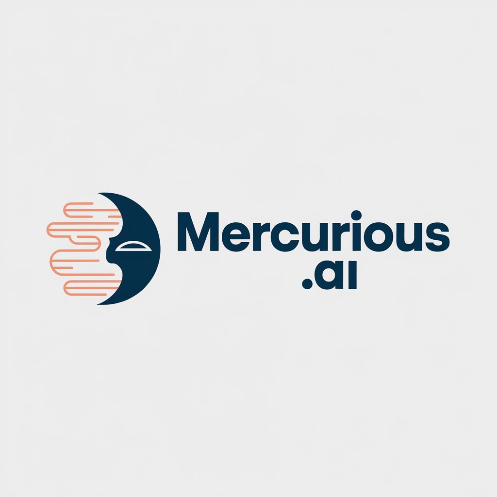

# 🧠 Mercurious.ai - AI-Powered Video Learning Assistant

<div align="center">
  
  
  **Transform YouTube videos into interactive learning experiences using cutting-edge AI technology**
  
  [](https://fastapi.tiangolo.com/)
  [](https://nextjs.org/)
  [](https://www.typescriptlang.org/)
  [](https://firebase.google.com/)
  [](https://ai.google/)
</div>

## 🌟 Overview

Mercurious.ai is a revolutionary AI-powered learning platform that transforms any YouTube video into a comprehensive learning experience. Using advanced AI technology including Google's Gemini AI, the platform automatically generates summaries, study guides, interactive chat assistance, and personalized learning content.

## ✨ Features

### 🎥 **Video Processing & Analysis**
- **YouTube Integration**: Process any YouTube video by simply pasting the URL
- **AI-Powered Transcription**: Automatic transcript extraction and processing
- **Content Analysis**: Deep AI analysis of video content using Google Gemini
- **Smart Summarization**: Generate concise, structured summaries
- **Key Concepts Extraction**: Identify and highlight important concepts and terms

### 🤖 **AI Learning Assistant**
- **Interactive Chat**: Ask questions about video content and get intelligent responses
- **Contextual Understanding**: AI maintains context of the video content during conversations
- **Study Guide Generation**: Automatically create comprehensive study guides
- **Vocabulary Extraction**: Identify and define important terms
- **Learning Analytics**: Track learning progress and comprehension

### 📚 **Personal Learning Library**
- **Video Library Management**: Organize and manage your processed videos
- **Progress Tracking**: Monitor your learning progress across all videos
- **Favorites System**: Mark and organize your favorite learning content
- **Search & Filter**: Quickly find videos by title, content, or progress status
- **Notes Management**: Take and save personal notes for each video

### 🔐 **Authentication & Security**
- **Firebase Authentication**: Secure user authentication and authorization
- **Protected Routes**: Secure access to personal learning content
- **User Profiles**: Personalized user accounts and settings
- **Data Privacy**: Secure storage of user data and learning progress

### 🎨 **Modern User Interface**
- **Responsive Design**: Seamless experience across desktop and mobile devices
- **Dark/Light Mode**: Customizable theme preferences
- **Professional UI**: Modern, intuitive interface built with Tailwind CSS
- **Performance Optimized**: Virtual scrolling and optimized rendering
- **Real-time Updates**: Live updates and notifications

## 🚧 Upcoming Features

We are actively working to make Mercurious.ai even better! Here are some features planned for future releases:

- **📝 Quiz System**: AI-generated quizzes for every video to test your understanding and reinforce learning
- **⚙️ User Settings**: Personalize your experience with theme, notification, and privacy preferences
- **👤 Profile Management**: Edit your profile, view learning stats, and manage your account
- **📒 Notes Editor**: Rich text note-taking and annotation tools for each video
- **📊 Analytics & Insights**: Visualize your learning progress and achievements
- **🔔 Notifications**: Stay updated with reminders and learning milestones
- **🛡️ Admin Panel**: Manage users, content, and platform analytics
- **🌐 Multi-language Support**: Learn in your preferred language
- **📱 Mobile App**: Native mobile experience for iOS and Android
- **🔗 Social Sharing**: Share your learning progress and favorite videos
- **🧑‍🤝‍🧑 Community Features**: Discussion forums, study groups, and peer support

## 🏗️ Architecture

### **Backend (FastAPI)**
```
backend/
├── app/
│   ├── main.py                 # FastAPI application entry point
│   ├── dependencies.py         # Authentication & database dependencies
│   ├── models/                 # Pydantic data models
│   │   ├── user.py            # User authentication models
│   │   ├── video.py           # Video processing models
│   │   ├── chat.py            # Chat interaction models
│   │   └── quiz.py            # Quiz generation models
│   ├── routers/               # API route handlers
│   │   ├── auth.py            # Authentication endpoints
│   │   ├── videos.py          # Video processing endpoints
│   │   └── chat.py            # Chat interaction endpoints
│   ├── services/              # Business logic services
│   │   ├── auth_service.py    # User authentication service
│   │   ├── video_services.py  # Video processing service
│   │   ├── transcript_services.py # AI transcript processing
│   │   ├── chat_service.py    # Chat interaction service
│   │   └── video_database_service.py # Database operations
│   ├── config/                # Configuration files
│   │   └── firebase_config.py # Firebase configuration
│   └── utils/                 # Utility functions
└── requirements.txt           # Python dependencies
```

### **Frontend (Next.js + TypeScript)**
```
frontend/mercurious/
├── src/
│   ├── app/                   # Next.js App Router
│   │   ├── page.tsx          # Landing page
│   │   ├── dashboard/        # User dashboard
│   │   ├── process/          # Video processing interface
│   │   ├── video/[id]/       # Video viewer and chat
│   │   └── layout.tsx        # Root layout
│   ├── components/           # Reusable UI components
│   │   ├── Auth/             # Authentication components
│   │   ├── ChatAssistant.tsx # AI chat interface
│   │   └── ProtectedRoute.tsx # Route protection
│   ├── contexts/             # React contexts
│   │   └── AuthContext.tsx   # Authentication context
│   ├── lib/                  # Utilities and configurations
│   │   ├── api/              # API client and services
│   │   └── firebase/         # Firebase configuration
│   └── styles/               # Global styles
├── package.json              # Node.js dependencies
└── tsconfig.json            # TypeScript configuration
```

## 🛠️ Technology Stack

### **Backend Technologies**
- **FastAPI**: High-performance Python web framework
- **Python 3.9+**: Modern Python with async/await support
- **Firebase Admin SDK**: Server-side Firebase integration
- **Google Generative AI**: Gemini AI for content processing
- **YouTube Transcript API**: Video transcript extraction
- **Pydantic**: Data validation and serialization
- **Uvicorn**: High-performance ASGI server

### **Frontend Technologies**
- **Next.js 15**: Latest React framework with App Router
- **TypeScript**: Type-safe JavaScript development
- **React 19**: Latest React with modern features
- **Tailwind CSS**: Utility-first CSS framework
- **Firebase SDK**: Client-side Firebase integration
- **Lucide React**: Modern icon library
- **React Window**: Virtual scrolling for performance

### **Infrastructure & Services**
- **Firebase Auth**: User authentication and authorization
- **Firebase Firestore**: NoSQL document database
- **Google Cloud**: AI and infrastructure services
- **YouTube Data API**: Video metadata and information

## 🚀 Quick Start

### Prerequisites
- **Node.js 18+** and npm
- **Python 3.9+** and pip
- **Firebase Project** with Auth and Firestore enabled
- **Google AI API Key** (Gemini)
- **YouTube Data API Key**

### Environment Setup

1. **Clone the repository**
```bash
git clone https://github.com/mrnithesh/Mercurious-ai.git
cd Mercurious-ai
```

2. **Backend Setup**
```bash
cd backend

# Create virtual environment
python -m venv venv
source venv/bin/activate  # On Windows: venv\Scripts\activate

# Install dependencies
pip install -r requirements.txt

# Create .env file
cp .env.example .env
```

3. **Configure Environment Variables**
```bash
# Backend .env
GEMINI_API_KEY=your_gemini_api_key
GEMINI_MODEL=gemini-2.0-flash
YOUTUBE_DATA_API=your_youtube_api_key
FIREBASE_PROJECT_ID=your_firebase_project_id
FIREBASE_SERVICE_ACCOUNT_PATH=path_to_firebase_service_account_json
JWT_SECRET_KEY=your_secret_key
JWT_ALGORITHM=HS256
JWT_ACCESS_TOKEN_EXPIRE_MINUTES=3600

```

4. **Frontend Setup**
```bash
cd frontend/mercurious

# Install dependencies
npm install

# Create environment file
cp .env.local.example .env.local
```

5. **Configure Frontend Environment**
```bash
# Frontend .env.local
NEXT_PUBLIC_FIREBASE_API_KEY=your_firebase_api_key
NEXT_PUBLIC_FIREBASE_AUTH_DOMAIN=your_project.firebaseapp.com
NEXT_PUBLIC_FIREBASE_PROJECT_ID=your_firebase_project_id
NEXT_PUBLIC_FIREBASE_STORAGE_BUCKET=your_project.appspot.com
NEXT_PUBLIC_FIREBASE_MESSAGING_SENDER_ID=your_sender_id
NEXT_PUBLIC_FIREBASE_APP_ID=your_app_id
```

### Running the Application

1. **Start the Backend**
```bash
cd backend
uvicorn app.main:app --reload
```
Backend will be available at `http://localhost:8000`

2. **Start the Frontend**
```bash
cd frontend/mercurious
npm run dev
```
Frontend will be available at `http://localhost:3000`

3. **Access the Application**
- Open `http://localhost:3000` in your browser
- Create an account or sign in
- Start processing YouTube videos!

## 🤝 Contributing

We welcome contributions! Please see our [Contributing Guidelines](CONTRIBUTING.md) for details.

1. Fork the repository
2. Create your feature branch (`git checkout -b feature/AmazingFeature`)
3. Commit your changes (`git commit -m 'Add some AmazingFeature'`)
4. Push to the branch (`git push origin feature/AmazingFeature`)
5. Open a Pull Request

Have a feature request? [Open an issue](https://github.com/mrnithesh/Mercurious-ai/issues) or [contact us on LinkedIn](https://www.linkedin.com/in/mrnithesh/)! 

## 📄 License

This project is licensed under the MIT License - see the [LICENSE](LICENSE) file for details.

## 🙏 Acknowledgments

- **Google AI** for Gemini AI technology
- **Firebase** for authentication and database services
- **YouTube** for video platform and API access
- **FastAPI** and **Next.js** communities for excellent frameworks
- **Open Source Community** for various libraries and tools

## 📞 Support

For support, contact on linkedin [Nithesh K](https://www.linkedin.com/in/mrnithesh/)!

---

<div align="center">
  <p>Built with ❤️ by the Mercurious.ai Team</p>
  <p>Making learning more accessible and engaging through AI</p>
</div> 

