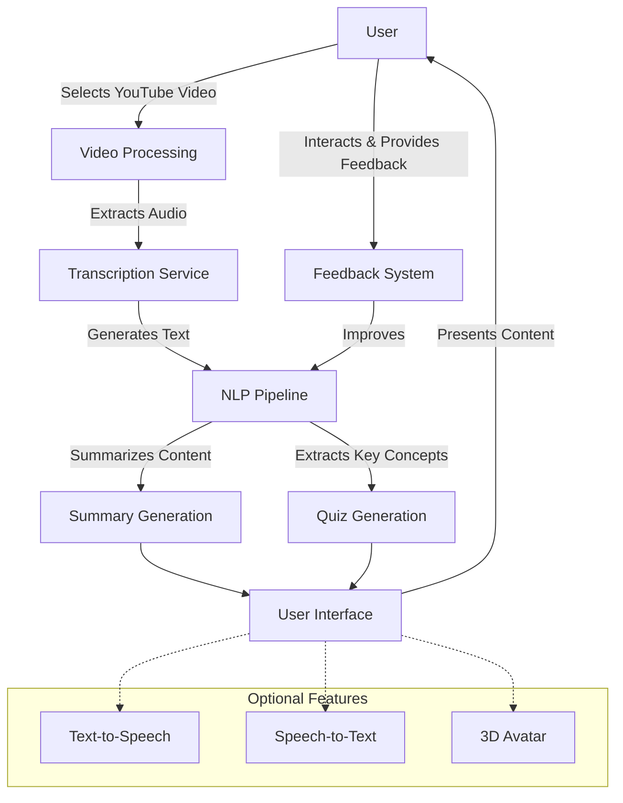

```mermaid

graph TD
    A[User] -->|Selects YouTube Video| B[Video Processing]
    B -->|Extracts Audio| C[Transcription Service]
    C -->|Generates Text| D[NLP Pipeline]
    D -->|Summarizes Content| E[Summary Generation]
    D -->|Extracts Key Concepts| F[Quiz Generation]
    E --> G[User Interface]
    F --> G
    G -->|Presents Content| A
    A -->|Interacts & Provides Feedback| H[Feedback System]
    H -->|Improves| D
    
    subgraph "Optional Features"
        I[Text-to-Speech]
        J[Speech-to-Text]
        K[3D Avatar]
    end
    
    G -.-> I
    G -.-> J
    G -.-> K
```